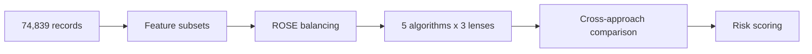

<p align="center">
  
</p>

<p align="center">
  
  
  
  
  
</p>

---

Teach For America's applications dropped 35% in three years. A hundred recruiters managing thousands of prospects had no way to tell which applicants would quietly disengage and which would make it to the classroom. This project builds 15 classification models across three analytical lenses -- behavioral, academic, and combined -- to score withdrawal risk before it happens. The result: **behavioral engagement signals predict dropout far more reliably than grades or school prestige ever could**, and a Combined SVM model gives TFA recruiters a practical way to focus their time on the applicants most likely to walk away.

> Case study: [People Analytics at Teach For America (A)](<docs/People Analytics at Teach For America A.pdf>)

---

<table width="100%">
<tr>
<td align="center" width="25%" valign="top">
<h1>74,839</h1>
<hr>
applicant records analyzed
</td>
<td align="center" width="25%" valign="top">
<h1>15</h1>
<hr>
models compared across 3 lenses
</td>
<td align="center" width="25%" valign="top">
<h1>67.9%</h1>
<hr>
top accuracy (combined decision tree)
</td>
<td align="center" width="25%" valign="top">
<h1>62.7%</h1>
<hr>
best balanced model (combined SVM)
</td>
</tr>
</table>

---

## Contents

| **Section** | **What you'll find** |
|---|---|
| [Project snapshot](#project-snapshot) | Quick-glance specs |
| [The problem](#the-problem) | Why TFA's funnel was leaking |
| [Data](#data) | 74,839 records, 39 variables, one outcome |
| [Three analytical lenses](#three-analytical-lenses) | Behavioral vs academic vs combined |
| [Analysis](#analysis) | 5 algorithms, 3 feature sets, 15 models |
| [Key findings](#key-findings) | What actually predicts withdrawal |
| [Recommendations](#recommendations) | What TFA should do differently |
| [Reproduce it](#reproduce-it) | Clone, install, run |

---

## Project snapshot

| **Domain** | People analytics, nonprofit recruitment |
|---|---|
| **Context** | Harvard Business School case study (Polzer & Kelley, 2018) |
| **Course** | MAX 522 -- Predictive Analytics, Stuart SChool of Business |
| **Tools** | R, caret, ROSE, e1071, nnet, C5.0 |
| **Methods** | KNN, Naive Bayes, Decision Trees, ANN, SVM (x3 feature sets) |
| **Dataset** | 74,839 TFA applicants, 39 variables, 80/20 train-test split |

---

## The problem

Between 2013 and 2016, applications to Teach For America fell from 57,000 to fewer than 38,000. A strengthening economy, brand confusion, and misaligned timing all played a role. But the less visible problem sat inside the funnel itself: of the applicants who did apply, a significant share withdrew before completing the admissions process -- after TFA had already invested recruiter time, interview slots, and regional placement planning.

TFA employed roughly 160 recruiters and associates who each managed hundreds of prospects. They had no systematic way to tell which applicants genuinely needed a nudge and which were already gone. Strong candidates disengaged unnoticed. Recruiter time went to applicants who were already going to complete -- or were already going to leave regardless.

| **Problem** | **Scale** |
|---|---|
| Application decline | 35% drop over 3 years (2013-2016) |
| Class imbalance | 80.7% completed, 19.3% withdrew |
| Recruiter bandwidth | ~160 staff across hundreds of campuses |
| Cost of a missed withdrawal | Wasted interview slots, planning, outreach hours |

The case asks two questions: What predictive models and variables should TFA use? And how heavily should the organization rely on them?

---

## Data

The dataset contains **74,839 applicant records** with **39 variables** covering academic background, behavioral engagement, essay features, and admissions outcomes.

**Academic variables** -- GPA, undergraduate institution selectivity (Least to Most Selective), STEM major/minor status, declared fields of study, and assigned region preference level.

**Behavioral variables** -- Registration date, application start date, submission date, deadline, event attendance, and three essay word counts plus NLP-derived metrics (unique word count, sentiment score).

**Target variable** -- `completedadm`: binary outcome where 1 = completed all admissions steps and 0 = withdrew at some point during the process.

The class split is heavily imbalanced (80.7% completed vs 19.3% withdrew), which we address with ROSE hybrid sampling on the training set only.

> The dataset originates from a [Harvard Business School case study](https://www.hbs.edu/faculty/Pages/item.aspx?num=54657) (Polzer & Kelley, 2018) and is used under academic license. It is not included in this repository.

---

## Three analytical lenses

Rather than building one model, we designed three parallel approaches to test which dimension of an applicant's profile actually predicts withdrawal.

<table width="100%">
<tr>
<td align="center" width="33%" valign="top">
<h3>Behavioral</h3>
<hr>
Timing, essay effort, event attendance<br><br><b>Tests:</b> Is withdrawal a motivation problem?
</td>
<td align="center" width="33%" valign="top">
<h3>Academic</h3>
<hr>
GPA, school selectivity, STEM status, major count<br><br><b>Tests:</b> Do stronger profiles persist more?
</td>
<td align="center" width="33%" valign="top">
<h3>Combined</h3>
<hr>
All behavioral + academic variables together<br><br><b>Tests:</b> Does a holistic view improve prediction?
</td>
</tr>
</table>

Each approach runs through the same five algorithms: KNN, Naive Bayes, Decision Trees (C5.0), Artificial Neural Networks, and SVM with radial kernel. Same preprocessing (center + scale), same class balancing (ROSE), same 80/20 partitioned holdout. The only thing that changes is the input features.

---

## Analysis



**Preprocessing across all approaches:**
1. Derived timing variables from raw dates: Days to Start, Days to Submit, Deadline Gap
2. Derived Total Essay Length from three essay word counts
3. Created major_count (number of declared majors/minors) and STEM binary flag
4. Dummy-encoded categorical variables (school selectivity, region preference, STEM)
5. 80/20 stratified train-test split using `createDataPartition()`
6. Applied ROSE hybrid over+under sampling on training set only (target: 50/50 balance)

**Five algorithms per lens, tuned via cross-validation:**

| **Algorithm** | **Tuning** | **CV** |
|---|---|---|
| KNN | k = 1-10 (auto) | 10-fold |
| Naive Bayes | Laplace {0-2}, kernel {T/F}, adjust {0.75-2} | 10-fold |
| Decision Tree (C5.0) | Tree vs rules, winnow, trials 1-9 | 10-fold |
| ANN (nnet) | Hidden units {5,10,15}, decay {0.1-0.7} | 5-fold |
| SVM (radial) | sigma = 0.01, C = {1,2} | 3-fold |

The full cross-approach comparison -- 15 models evaluated on accuracy, sensitivity, specificity, and Kappa:

<table width="100%">
<tr>
<th align="left" width="25%">Model</th>
<th align="center" width="25%">Behavioral</th>
<th align="center" width="25%">Academic</th>
<th align="center" width="25%">Combined</th>
</tr>
<tr><td colspan="4"><b>KNN</b></td></tr>
<tr><td>Accuracy</td><td align="center">52.5%</td><td align="center">54.8%</td><td align="center">54.1%</td></tr>
<tr><td>Sensitivity</td><td align="center">51.4%</td><td align="center">54.4%</td><td align="center">53.4%</td></tr>
<tr><td>Specificity</td><td align="center">57.2%</td><td align="center">56.3%</td><td align="center">56.8%</td></tr>
<tr><td>Kappa</td><td align="center">0.053</td><td align="center">0.068</td><td align="center">0.064</td></tr>
<tr><td colspan="4"><b>Naive Bayes</b></td></tr>
<tr><td>Accuracy</td><td align="center">44.0%</td><td align="center">56.2%</td><td align="center">49.1%</td></tr>
<tr><td>Sensitivity</td><td align="center">35.6%</td><td align="center">53.7%</td><td align="center">41.3%</td></tr>
<tr><td>Specificity</td><td align="center">79.4%</td><td align="center">66.4%</td><td align="center">81.7%</td></tr>
<tr><td>Kappa</td><td align="center">0.077</td><td align="center">0.125</td><td align="center">0.123</td></tr>
<tr><td colspan="4"><b>Decision Tree (C5.0)</b></td></tr>
<tr><td>Accuracy</td><td align="center">62.9%</td><td align="center">55.6%</td><td align="center"><b>67.9%</b></td></tr>
<tr><td>Sensitivity</td><td align="center">67.8%</td><td align="center">53.6%</td><td align="center"><b>74.1%</b></td></tr>
<tr><td>Specificity</td><td align="center">42.3%</td><td align="center">64.0%</td><td align="center">41.6%</td></tr>
<tr><td>Kappa</td><td align="center">0.077</td><td align="center">0.110</td><td align="center">0.132</td></tr>
<tr><td colspan="4"><b>ANN</b></td></tr>
<tr><td>Accuracy</td><td align="center">57.5%</td><td align="center">55.8%</td><td align="center">62.4%</td></tr>
<tr><td>Sensitivity</td><td align="center">56.8%</td><td align="center">53.1%</td><td align="center">62.2%</td></tr>
<tr><td>Specificity</td><td align="center">60.7%</td><td align="center">67.2%</td><td align="center">63.1%</td></tr>
<tr><td>Kappa</td><td align="center">0.113</td><td align="center">0.125</td><td align="center"><b>0.173</b></td></tr>
<tr><td colspan="4"><b>SVM (radial)</b></td></tr>
<tr><td>Accuracy</td><td align="center">52.7%</td><td align="center">58.4%</td><td align="center">62.7%</td></tr>
<tr><td>Sensitivity</td><td align="center">49.4%</td><td align="center">56.7%</td><td align="center">62.9%</td></tr>
<tr><td>Specificity</td><td align="center">66.7%</td><td align="center">65.2%</td><td align="center">61.9%</td></tr>
<tr><td>Kappa</td><td align="center">0.096</td><td align="center">0.141</td><td align="center">0.171</td></tr>
</table>

The Combined SVM is the most balanced performer across all 15 models. The Combined Decision Tree achieved the highest raw accuracy at 67.9%, but its specificity (41.6%) means it misses most withdrawals -- good at confirming completers but bad at catching the people TFA actually needs to reach.

---

## Key findings

Behavioral engagement predicts withdrawal far more reliably than academic credentials. Applicants who start late, take longer to submit, or skip TFA events are significantly more likely to disengage -- regardless of GPA, school rank, or STEM background.

Four patterns held across all 15 models:

**1. Behavioral timing is the strongest withdrawal signal.** Applicants who delay starting their application after registering, take longer to submit after starting, or submit right at the deadline show higher dropout rates. These timing gaps reflect declining motivation in real time.

**2. Academic variables add texture, not predictive power.** GPA, STEM status, and school selectivity produce models that barely clear random chance when used alone. A 3.8 GPA from a "Most Selective" school does not mean someone will finish the process.

**3. Combined models outperform both subsets.** Every algorithm improved when behavioral and academic features were merged. Decision Trees, ANN, and SVM all crossed 62% accuracy in the combined setting -- none reached it in isolation. The interaction between engagement patterns and background creates signals that neither dimension contains on its own.

**4. Event attendance consistently predicts persistence.** Applicants who attended a TFA-hosted recruiting event completed the process at higher rates across every model. Only 12.6% of applicants attended events, making this a high-signal, low-base-rate variable.

---

## Recommendations

Based on the modeling results, five actions for TFA's recruitment and admissions team:

**Implement an SVM-based withdrawal risk scoring system.** The Combined SVM provides the best balance of sensitivity and specificity. Assign each applicant a dynamic risk score early in the process and update it as behavioral signals accumulate.

**Automate nudges using behavioral timing variables.** Trigger personalized reminders when applicants show late starts, long inactivity gaps, or missed milestones. The Days to Start and Days to Submit windows are where disengagement becomes measurable.

**Direct recruiter time toward high-risk, high-potential applicants.** Instead of meeting with every accepted candidate, use risk scores to triage. A recruiter spending 20 minutes with someone the model flags at 70% withdrawal risk produces more value than 20 minutes with someone at 10%.

**Strengthen mid-application touchpoints.** The Deadline Gap variable shows that withdrawals cluster in the window between application start and submission. Progress trackers, check-in emails, and support messages during this period could catch disengagement before it becomes a dropout.

**Expand event attendance.** At 12.6% attendance, TFA events are an underutilized channel. Applicants who attend complete at higher rates. Virtual events, regional alumni meetups, and campus previews could increase touchpoints without proportional cost.

---

## Reproduce it

**Install R packages**

```r
install.packages(c("class", "e1071", "nnet", "rpart", "caret",
                    "dplyr", "ROSE", "pROC", "fastDummies",
                    "NeuralNetTools", "tidyr"))
```

**Run the models**

```r
# Each script is self-contained:
source("code/01_behavioral_model.R")   # Behavioral approach (5 models)
source("code/02_academic_model.R")     # Academic approach (5 models)
source("code/03_combined_model.R")     # Combined approach (5 models)
```

**Data:** Place the CSV in the project root as `People Analytics at Teach For America Data Set.csv`. The dataset is available in the [data/](data/) folder.

---

<p align="center">
  Part of <b>Sai Seetal Pendyala</b>'s Analytics Portfolio<br>
  <a href="https://www.linkedin.com/in/sai-seetal-pendyala/">LinkedIn</a> · <a href="https://github.com/sai-seetal-pendyala">GitHub</a>
</p>
